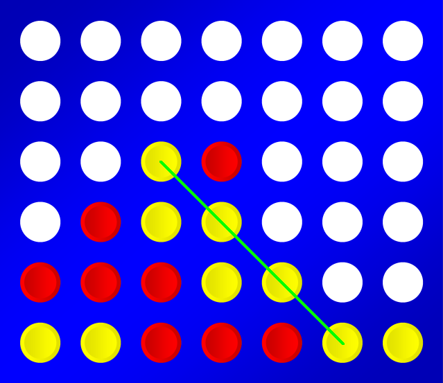
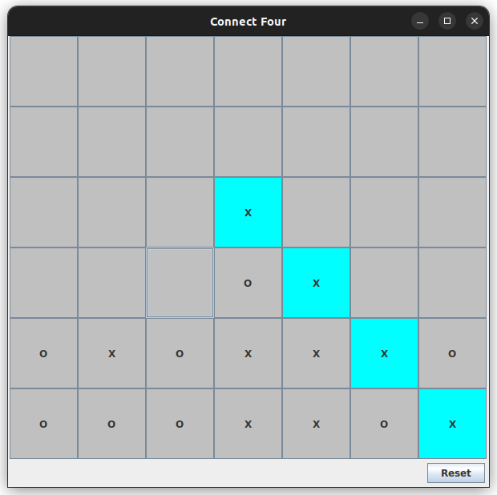

# Connect Four

__Vier gewinnt__ (englisch: Connect Four) ist ein Zweipersonen-Strategiespiel mit dem Ziel, als Erster vier der eigenen Spielsteine in eine Linie zu bringen. Ich habe das Spiel in vier Stadien in ein Desktop Spiel mit einer GUI-Oberfläche umgesetzt.



## Regeln

Das originelle Spiel wird auf einem senkrecht stehenden hohlen Spielbrett gespielt, in das die Spieler abwechselnd ihre Spielsteine fallen lassen. Das Spielbrett besteht aus sieben Spalten (senkrecht) und sechs Reihen (waagerecht). Wenn ein Spieler einen Spielstein in eine Spalte fallen lässt, besetzt dieser den untersten freien Platz der Spalte. Gewinner ist der Spieler, der es als erster schafft, vier oder mehr seiner Spielsteine waagerecht, senkrecht oder diagonal in eine Linie zu bringen. Das Spiel endet unentschieden, wenn das Spielbrett komplett gefüllt ist, ohne dass ein Spieler eine Viererlinie gebildet hat.

### 1. Stadium

Als erstes habe ich ein leeres Brett programmiert. Ich habe die Spalten mit Großbuchstaben und die Reihen mit Zahlen gekennzeichnet.


Der Code sah am Anfang simple aus. Die Hauptklasse erbt JFrame und heißt Connect Four. Die Zellen erben JButton.

```java
public class ConnectFour extends JFrame {
    public static final int ROWS = 6;
    public static final int COLS = 7;
    public ConnectFour() {
        setDefaultCloseOperation(JFrame.EXIT_ON_CLOSE);
        setSize(600, 600);
        setTitle("Connect Four");

        for (int i = 0; i < ROWS; i++) {
            for (int j = 0; j < COLS; j++) {
                JButton button = new JButton();
                char column = (char) ('A' + j);
                String name = column + String.valueOf(ROWS - i);
                button.setText(name);
                button.setName("Button" + name);
                button.setFocusPainted(false);
                add(button);
            }
        }
        setLayout(new GridLayout(6, 7));
        setVisible(true);
    }
}
```

### 2. Stadium

Mit leerem Brett kann man nicht viel anfangen. Ich habe dann 2 wichtige Features hinzugefügt. Ich habe es den Spielern ermöglicht, mit X und O zu kreuzen.
Zweitens habe ich es den Spielern ermöglicht zu alternieren. X beginnt. Nach jedem Kreuz wechselt sich das Zeichen. In diesem Stadium wird dort ein Kreuz gesetzt, wo der Spieler geklickt hat.


Am Anfang wird jede Zelle mit einem einzelnen Leerzeichen abgebildet. Wenn ein Spieler auf eine Zelle klickt, ändert sie ihren Text auf X oder O jenachdem welcher Spieler daran ist.

```java
public class ConnectFour extends JFrame implements ActionListener {
    public static final int ROWS = 6;
    public static final int COLS = 7;
    private int turn;
    private final String[] turns;
    public ConnectFour() {
        this.turn = 0;
        this.turns = new String[]{"X", "O"};
        setDefaultCloseOperation(JFrame.EXIT_ON_CLOSE);
        setSize(600, 600);
        setTitle("Connect Four");

        for (int i = 0; i < ROWS; i++) {
            for (int j = 0; j < COLS; j++) {
                JButton button = new JButton();
                char column = (char) ('A' + j);
                String name = column + String.valueOf(ROWS - i);
                button.setText(" ");
                button.setName("Button" + name);
                button.setFocusPainted(false);
                button.addActionListener(this);
                add(button);
            }
        }
        setLayout(new GridLayout(6, 7));
        setVisible(true);
    }

    @Override
    public void actionPerformed(ActionEvent actionEvent) {
        String label = this.turns[this.turn % this.turns.length];
        ((JButton) actionEvent.getSource()).setText(label);
        this.turn++;
    }
}
```

### 3. Stadium

Im echten Vier Gewinnt werden die Steine nicht dort gesetzt, wo Sie platziert sind, sondern sie fallen runter. Diese Eigenschaft wird in diesem Stadium eingebaut.
Die erste freie Zelle in der Spalte wo es gekreuzt wird, wird der Stein gesetzt. Somit brauche ich Spaltenweise kontrollieren wo die erste freie Zelle ist.

```java
public class ConnectFour extends JFrame implements ActionListener {
    public static final int ROWS = 6;
    public static final int COLS = 7;
    private int turn;
    private JButton[][] board;
    private final String[] turns;
    public ConnectFour() {
        this.turn = 0;
        this.turns = new String[]{"X", "O"};
        this.board = new JButton[ROWS][COLS];
        setDefaultCloseOperation(JFrame.EXIT_ON_CLOSE);
        setSize(600, 600);
        setTitle("Connect Four");

        for (int i = 0; i < ROWS; i++) {
            for (int j = 0; j < COLS; j++) {
                JButton button = new JButton();
                String name = (char) ('A' + j) + String.valueOf(ROWS - i);
                button.setText(" ");
                button.setName("Button" + name);
                button.setFocusPainted(false);
                button.addActionListener(this);
                add(button);
                this.board[ROWS - 1 - i][j] = button;
            }
        }

        setLayout(new GridLayout(6, 7));
        setVisible(true);
    }

    @Override
    public void actionPerformed(ActionEvent actionEvent) {
        String label = this.turns[this.turn % this.turns.length];
        int column = ((JButton) actionEvent.getSource()).getName().charAt("Button".length()) - 'A';
        for (int i = 0; i < ROWS; i++) {
            if (this.board[i][column].getText().equals(" ")) {
                this.board[i][column].setText(label);
                break;
            }
        }
        this.turn++;
    }
}
```

### 4. Stadium

In diesem Stadium habe ich einen Algorithmus entwickelt, der nach jedem Klick kontrolliert, ob vier Steine in einer Reihe sind.
Die Kontrolle wird in horizontaler, vertikaler und diagonaler Richtung durchgeführt. Wenn der Algorithmus eine Gewinnstellung detektiert hat, markiert das Programm diese vier Zellen damit die Spieler leicht erkennen können, wer gewonnen hat.


Am Anfang des Programs bekommt jede Zelle eine graue Hintergrundfarbe. Eine helle Farbe bekommen die gewinnenden 4 Zellen am Ende des Spiels.
Wenn einer Spieler eine Zelle klickt die schon besetzt ist, passiert nichts. Der gleiche Spieler darf weiter spielen.

Nachdem ein Spieler gewonnen hat und 4 Zellen hellgefärbt sind, wird es nichts geändert, wenn der Spieler irgendeine Zelle klickt.
Eines der wichtigsten Features die in diesem letzten Stadium hinzugekommen sind, ist der Reset-Button, unten rechts im Fenster. Das Klicken des Reset-Buttons setzt alle Zellen auf Leerzeichen und Hintergrundfarbe wird wieder überall grau.

Für den Algorithmus wurden eine neue Klasse Cell und eine Enum Content definiert um den Zellinhalt besser steuern zu können.

```java
public class ConnectFour extends JFrame implements ActionListener {
    public static final int ROWS = 6;
    public static final int COLS = 7;
    private int turn;
    private Cell[][] board;
    private final Content[] contents;
    private boolean gameOver;


    public ConnectFour() {
        this.gameOver = false;
        this.turn = 0;
        this.contents = Content.values();
        this.board = new Cell[ROWS][COLS];
        setDefaultCloseOperation(JFrame.EXIT_ON_CLOSE);
        setSize(600, 600);
        setTitle("Connect Four");
        setLayout(new BorderLayout());

        JPanel boardPane = new JPanel();
        boardPane.setLayout(new GridLayout(6, 7));
        add(boardPane, BorderLayout.CENTER);

        JPanel resetPane = new JPanel();
        resetPane.setLayout(new FlowLayout(FlowLayout.RIGHT));
        JButton resetButton = new JButton("Reset");
        resetButton.setName("ButtonReset");
        resetButton.addActionListener(new ActionListener() {
            @Override
            public void actionPerformed(ActionEvent actionEvent) {
                resetBoard();
                setGameOver(false);
            }
        });
        resetPane.add(resetButton);
        add(resetPane, BorderLayout.SOUTH);

        for (int i = ROWS - 1; i >= 0; i--) {
            for (int j = 0; j < COLS; j++) {
                Cell cell = new Cell(i, j);
                cell.addActionListener(this);
                boardPane.add(cell);
                this.board[i][j] = cell;
            }
        }

        setVisible(true);
    }

    public void setGameOver(boolean gameOver) {
        this.gameOver = gameOver;
        this.turn = 0;
    }
    private void resetBoard() {
        Cell cell;
        for (int i = ROWS - 1; i >= 0; i--) {
            for (int j = 0; j < COLS; j++) {
                this.board[i][j].reset();
            }
        }
    }

    @Override
    public void actionPerformed(ActionEvent actionEvent) {
        if (this.gameOver) {
            return;
        }
        Cell selectedCell = (Cell) actionEvent.getSource();

        if (!selectedCell.isEmpty()) {
            return;
        }
        Content content = this.contents[this.turn++ % 2];
        int column = selectedCell.getColumn();
        int row = 0;
        for (; row < ROWS; row++) {
            if (this.board[row][column].isEmpty()) {
                selectedCell = this.board[row][column];
                selectedCell.setContent(content);
                break;
            }
        }

        if (row < ROWS && isGameOver(selectedCell)) {
            setGameOver(true);
        }
    }

    private boolean isGameOver(Cell cell) {
        int i = cell.getRow();
        int j = cell.getColumn();
        Content content = cell.getContent();
        List<Cell> cells = null;
        cells = isVerticalConnectedFour(i, j, content);
        if (cells != null) {
            cells.add(cell);
            cells.forEach(connectedCell -> connectedCell.highlight());
            return true;
        }
        cells = isHorizontalConnectedFour(i, j, content);
        if (cells != null) {
            cells.add(cell);
            cells.forEach(connectedCell -> connectedCell.highlight());
            return true;
        }
        cells = isDescendingDiagonalConnectedFour(i, j, content);
        if (cells != null) {
            cells.add(cell);
            cells.forEach(connectedCell -> connectedCell.highlight());
            return true;
        }
        cells = isAscendingDiagonalConnectedFour(i, j, content);
        if (cells != null) {
            cells.add(cell);
            cells.forEach(connectedCell -> connectedCell.highlight());
            return true;
        }
        return false;
    }

    private List<Cell> isVerticalConnectedFour(int i, int j, Content content) {
        if (i < 3) {
            return null;
        }
        for (int k = 1; k < 4; k++) {
            Content other = this.board[i - k][j].getContent();
            if (content != other) {
                return null;
            }
        }
        List<Cell> cells = new ArrayList<>();
        for (int k = 0; k < 4; k++) {
            cells.add(this.board[i - k][j]);
        }
        return cells;
    }

    private List<Cell> isHorizontalConnectedFour(int i, int j, Content content) {
        List<Cell> cells = new ArrayList<>();
        for (int k = 1; k < 4 && k <= j; k++) {
            Cell left = this.board[i][j - k];
            if (left.getContent() == content) {
                cells.add(left);
            } else {
                break;
            }
        }
        for (int k = 1; k < 4 && k + j < COLS; k++) {
            Cell right = this.board[i][j + k];
            if (right.getContent() == content) {
                cells.add(right);
            } else {
                break;
            }
        }
        return cells.size() < 3 ? null : cells;
    }

    private List<Cell> isAscendingDiagonalConnectedFour(int i, int j, Content content) {
        List<Cell> cells = new ArrayList<>();
        for (int k = 1; k < 4 && k <= j && k <= i; k++) {
            Cell leftDown = this.board[i - k][j - k];
            if (leftDown.getContent() == content) {
                cells.add(leftDown);
            } else {
                break;
            }
        }
        for (int k = 1; k < 4 && k + j < COLS && k + i < ROWS; k++) {
            Cell rightUp = this.board[i + k][j + k];
            if (rightUp.getContent() == content) {
                cells.add(rightUp);
            } else {
                break;
            }
        }
        return cells.size() < 3 ? null : cells;
    }

    private List<Cell> isDescendingDiagonalConnectedFour(int i, int j, Content content) {
        List<Cell> cells = new ArrayList<>();
        for (int k = 1; k < 4 && k <= j && i + k < ROWS; k++) {
            Cell leftUp = this.board[i + k][j - k];
            if (leftUp.getContent() == content) {
                cells.add(leftUp);
            } else {
                break;
            }
        }
        for (int k = 1; k < 4 && k + j < COLS && k <= i; k++) {
            Cell rightDown = this.board[i - k][j + k];
            if (rightDown.getContent() == content) {
                cells.add(rightDown);
            } else {
                break;
            }
        }
        return cells.size() < 3 ? null : cells;
    }
}
```